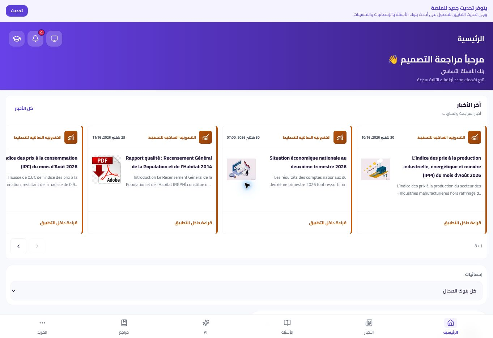
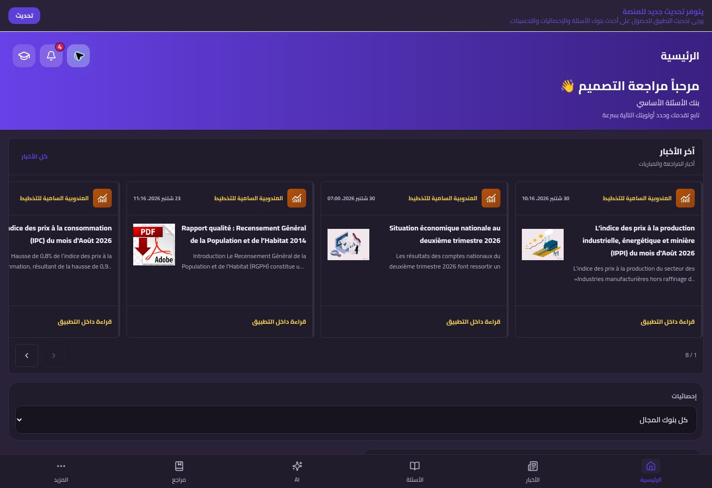
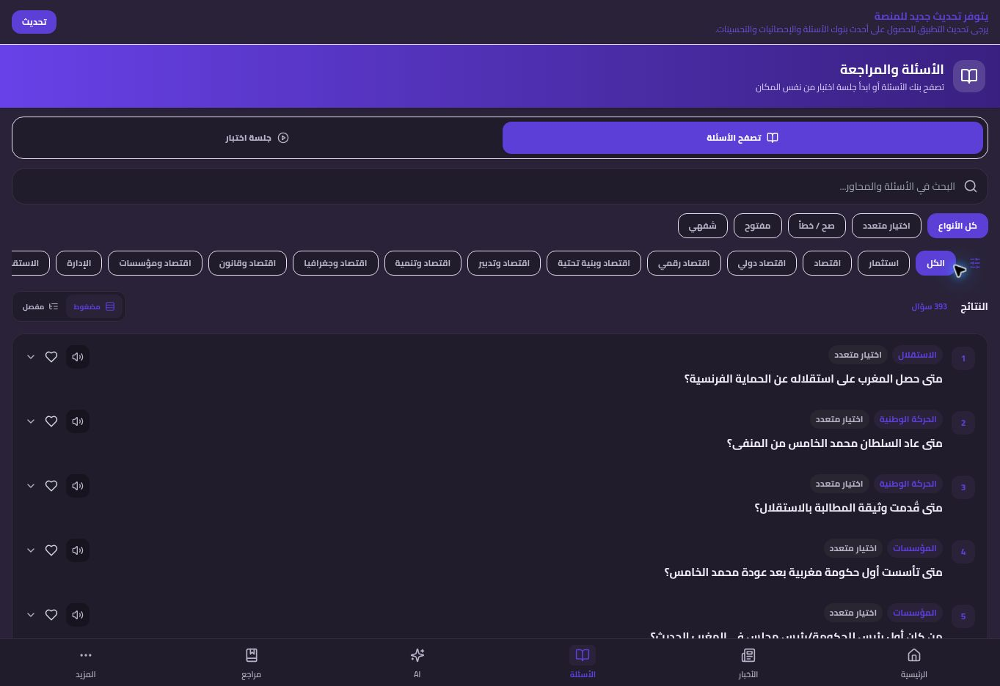

# مراجعة تصميم راجع

نطاق هذه الجولة: نسخة الويب المنشورة، التهيئة والتنقل إلى الرئيسية نهارًا وليلًا ثم الأسئلة. الصور أدناه التقطت أثناء هذه الجولة قبل الإصلاحات. لا تمثل صورًا للنسخة المعدّلة ولا اختبارًا لأندرويد.

## الخطوات والأدلة

1. **الرئيسية النهارية — تعمل، وتحتاج ضبط العرض.** التنقل والتهيئة يعملان؛ عرض التطبيق وشريطه يمتدان على الشاشة الواسعة، ويزداد تباعد عناصر التحكم. أضيف سقف عرض 1024px للحاوية والشريط مع الحفاظ على العرض الكامل للشاشات الأصغر.

2. **الرئيسية الليلية — تعمل، مع ضعف تباين.** النص البنفسجي في الشريط النشط وإشعار التحديث منخفض التباين. أضيف لون نص فاتح على الأسطح الليلية. نسبة التباين المحسوبة للبنفسجي على #201c2b تحسنت من نحو 2.48:1 إلى 9.01:1؛ حساب الألوان لا يغني عن اختبار جميع الحالات المرئية.

3. **صفحة الأسئلة الليلية — تعمل، مع مشكلات وضوح ودلالات.** شارات البنفسجي ضعيفة التباين. حقل البحث بلا تسمية صريحة، وحالة مفاتيح التبديل والفلاتر لا تُعلن كحالة ضغط. أضيفت تسميات للبحث ومسحه، وللإشعارات ورجوع التهيئة، وربط اختيار البنك بتسميته، وحالات aria-pressed.

## تداخل التهيئة

أظهر فحص شجرة الوصول بعد إكمال التهيئة ظهور الجولة الإرشادية وإعلان بعيد في آن واحد. عُدّل شرط الجولة لانتظار إغلاق الإعلان أو نافذة الإشعارات أو السؤال المباشر. ضُبط عرض بطاقة الجولة وأضيف اسم لحوارها. محتوى الإعلان يأتي من الإعداد البعيد، وليس من نص واجهة محلي؛ لم يعدَّل المحتوى البعيد في هذه الجولة.

## التحقق والحدود

- تمت مراجعة المنطق والأمان أولًا، ثم مراجعة التغييرات النهائية مرة ثانية.
- نجح فحص TypeScript والبناء. صُحّح محدّد CSS قديم ذو هروب زائد كان يولّد تحذيرًا في البناء.
- لا تزال رسالة البناء الخاصة بحزمة أكبر من 500kB قائمة؛ تحتاج عملًا مستقلًا على تقسيم التحميل.
- تعذّر فتح المعاينة المحلية في متصفح الجلسة بسبب ERR_BLOCKED_BY_CLIENT. المراجعة البصرية للتغييرات بعد التنفيذ **معلّقة**؛ الصور تخص النسخة المنشورة قبل التعديل.
- لم يُجر اختبار هاتف أو APK أو اعتماد شامل لإتاحة الاستخدام. لا تشمل هذه الجولة جميع شاشات التطبيق.

## معايير استكمال المراجعة البصرية

شغّل الفرع المعدّل وافحص مقاسات الهاتف والشاشة الواسعة، ومحاذاة الشريط مع الحاوية، وتباين النصوص في الثيمين، ومراحل الجولة مع الإعلان، والبحث والفلاتر والتنقل بلوحة المفاتيح. سجّل أدلة جديدة قبل وصف المراجعة البصرية بأنها مكتملة.

## قرار لوحة الألوان — استكمال الإصلاح

البنفسجي مناسب لهوية راجع؛ احتفظنا به للأفعال الأساسية والعناوين، مع لافندر فاتح للنص البنفسجي ليلًا. أضيفت متغيرات CSS مركزية للخلفيات والنصوص والحدود وحالات النجاح والخطأ والتنبيه. أزيلت قواعد الخلفية المكررة التي كانت تجعل #F8F9FD سطحًا بنفسجيًا ليلًا بدل خلفية محايدة. أصلحت خلفية علامة الإجابة وحدود السؤال الموسع ليلًا، وزيد وضوح قلب المفضلة وأضيفت aria-pressed.

| الدور | النهار: النص / الخلفية | الليل: النص / الخلفية | التباين النهاري / الليلي |
|---|---|---|---|
| نص ثانوي على سطح خافت | #62606F / #F5F3FF | #B9B2C8 / #292238 | 5.60 / 7.44 |
| نجاح | #126B3E / #EAF8F0 | #76DDB0 / #173229 | 6.00 / 8.36 |
| خطأ | #B42332 / #FFE8E8 | #FFB4B4 / #382126 | 5.57 / 8.80 |
| تنبيه | #92400E / #FFFBEB | #F2C96D / #352D1E | 6.84 / 8.64 |

النسب حسابية للأزواج المذكورة؛ لا تمثل فحص كل التركيبات أو حالات التفاعل. لم تتغير البيانات أو التخزين أو إعدادات الأمان. اجتاز الاستكمال TypeScript والبناء وفحص الفراغات، مع مراجعتين للكود. تبقى حدود المعاينة وAndroid المذكورة أعلاه قائمة.
